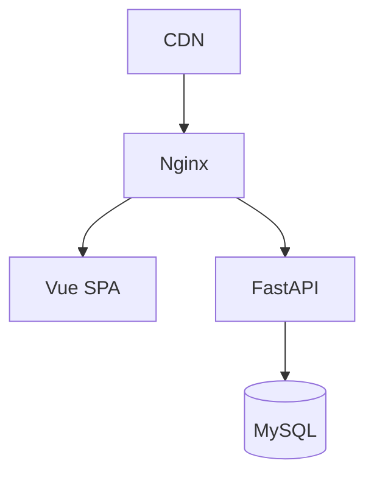
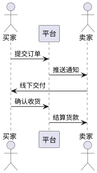

# 校园二手图书交易商城需求说明

## 1. 业务背景
学生群体存在大量闲置教材和教辅书籍的流通需求，需要建立安全可靠的C2C交易平台，采用线下自提+线上支付的闲鱼模式，降低交易风险。

## 2. 系统架构
### 2.1 技术栈
- 前端：Arco Design Vue3组件库
- 后端：FastAPI框架 + SQLModel ORM
- 数据库：MySQL 9.3.0

### 2.2 部署环境


## 3. 核心功能
### 3.1 商品管理（EC001）
- 用户可发布带ISBN的教材信息
- 支持多维度检索（书名/专业/课程）
- 书籍状态标记（全新/9成新/有笔记）

### 3.2 交易流程（EC002）


## 4. 非功能需求
### 4.1 性能指标
- API响应时间 ≤500ms(P99)
- 并发能力 ≥1000TPS

### 4.2 安全要求
- 支付接口必须使用HTTPS
- 敏感数据需AES256加密

## 5. 数据库设计
```sql
CREATE TABLE books (
    id BIGINT PRIMARY KEY AUTO_INCREMENT,
    isbn CHAR(13) NOT NULL,
    title VARCHAR(255) NOT NULL,
    major VARCHAR(50) COMMENT '所属专业',
    price DECIMAL(8,2) CHECK(price > 0),
    seller_id BIGINT NOT NULL REFERENCES users(id),
    status ENUM('AVAILABLE','SOLD') DEFAULT 'AVAILABLE'
);
```

## 6. 接口规范
**示例请求**：
```http
POST /api/v1/orders
Authorization: Bearer <token>
Content-Type: application/json

{
  "book_id": 12345,
  "meet_location": "图书馆南门"
}
```

**成功响应**：
```json
{
  "code": 201,
  "data": {
    "order_id": "20240520123456",
    "qr_code": "https://cdn.example.com/qr/abcd1234"
  }
}
```