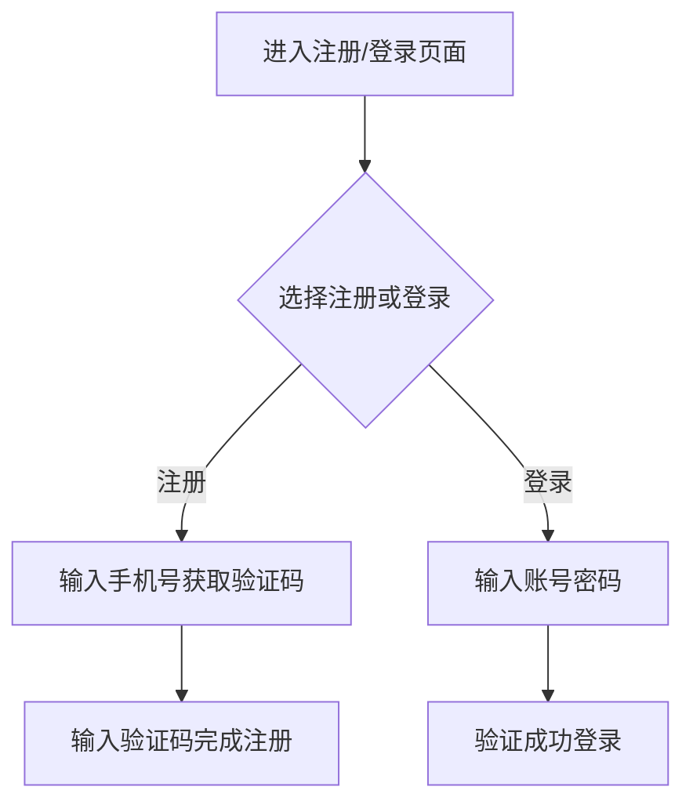

# 1. 核心需求
开发一个校园二手图书交易商城，交易采用类似闲鱼APP的自提自付款方式，前端使用arco.design vue版本，后端使用FastApi+SQLModel，数据库使用MySQL9.3.0。

## 2. 技术约束

| 类型 | 约束条件            |
| ---- | ------------------- |
| 前端 | arco.design vue版本 |
| 后端 | FastApi+SQLModel    |
| 部署 | MySQL9.3.0          |

## 3. 需求功能

### 3.1 用户模块

#### 需求 1： 用户注册登录
**用户故事：** 作为学生用户，我希望可以注册和登录账号以便使用校园二手图书交易商城。

##### 验收标准
1. 输入有效的手机号和验证码，系统应当成功注册账号。
2. 输入已注册的账号和密码，系统应当成功登录。

> ##### 类型：通用性
##### 处理逻辑：  

### 3.2 图书模块

### 3.3 交易模块

### 3.4 消息模块

## 4. 非功能需求
### 4.1 性能指标
| 场景      | 要求         | 验证方式     |
| --------- | ------------ | ------------ |
| 页面加载  | 小于3秒      | 工具测试     |
| 接口响应  | 小于1秒      | 工具测试     |

### 4.2 安全需求
- 🔒 密码加密存储 (如：bcrypt加密) 
- 🔒 SQL注入防护 
- 🔒 XSS攻击防护 

### 4.3 兼容性
| 平台      | 支持版本     |
| --------- | ------------ |
| 主流浏览器 | 最新2个版本  |
| Android   | 8.0及以上    |
| iOS       | 12.0及以上   |