# 1. 核心需求
开发一个基于校园环境的二手图书交易商城，专注于为学生和教职工提供便捷的图书交易服务。系统采用类似闲鱼APP的自提自付款模式，实现图书信息发布、浏览、搜索、交易协商、订单管理等功能，促进校园内图书资源的高效流转和知识共享。

## 2. 技术约束

| 类型 | 约束条件            |
| ---- | ------------------- |
| 前端 | arco.design vue版本 (Vue 3+) |
| 后端 | FastApi+SQLModel (Python 3.9+)    |
| 数据库 | MySQL9.3.0 (主机：localhost, 端口：3306, 用户名：root, 密码：root) |
| 部署 | 开发环境：Windows 10+/macOS 11+；生产环境：Linux (Ubuntu 20.04+) |
| 版本控制 | Git |
| API文档 | Swagger/OpenAPI |
| 容器化 | Docker |

## 3. 需求功能

### 3.1 用户管理模块

#### 需求 1：用户注册
**用户故事：** 作为校园学生/教职工，我希望能够注册账号，以便使用二手图书交易功能

##### 验收标准
1. 未注册用户访问系统时，应当显示注册入口
2. 用户填写正确的校园邮箱、密码和个人信息后，系统应当成功创建账号并发送验证邮件

> ##### 类型：事件驱动
##### 处理逻辑：
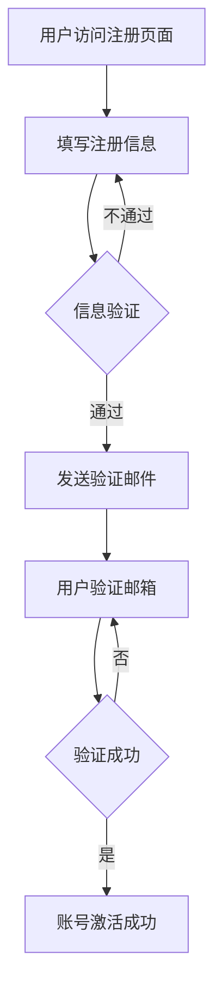

#### 需求 2：用户登录
**用户故事：** 作为已注册用户，我希望能够登录系统，以便使用二手图书交易功能

##### 验收标准
1. 已注册用户访问系统时，应当显示登录入口
2. 用户输入正确的账号和密码后，系统应当成功登录并跳转到首页
3. 登录状态应当在会话期间保持有效
4. 系统应当提供"记住我"选项，允许用户在一定时间内无需重新登录

> ##### 类型：事件驱动
##### 处理逻辑：
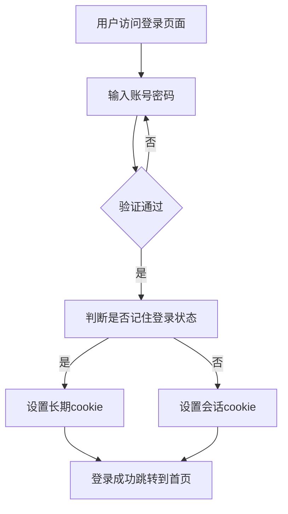

#### 需求 3：个人信息管理
**用户故事：** 作为已登录用户，我希望能够管理个人信息，以便更新我的资料和偏好

##### 验收标准
1. 已登录用户应当能够访问个人信息页面
2. 用户应当能够修改个人资料（如姓名、头像、联系方式等）
3. 用户修改信息后，系统应当保存并更新显示
4. 用户应当能够修改密码

> ##### 类型：状态驱动
##### 处理逻辑：
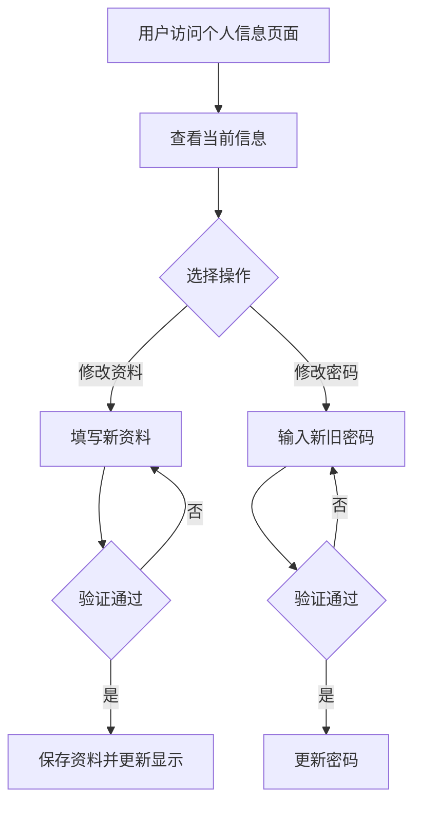

#### 需求 4：身份认证
**用户故事：** 作为系统管理员，我希望用户能够进行身份认证，以确保交易安全和用户真实性

##### 验收标准
1. 用户应当能够上传学生证或教师证进行身份认证
2. 系统应当对上传的证件进行审核
3. 认证通过后，用户资料页应当显示认证标志
4. 未认证用户在进行某些操作时（如发布商品）应当收到认证提示

> ##### 类型：条件驱动
##### 处理逻辑：
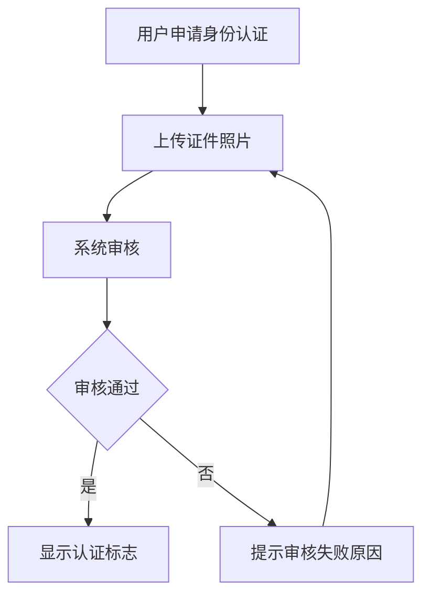

### 3.2 图书管理模块

#### 需求 5：图书发布
**用户故事：** 作为已登录用户，我希望能够发布二手图书信息，以便出售我的闲置图书

##### 验收标准
1. 已登录用户应当能够访问图书发布页面
2. 用户应当能够填写图书基本信息（书名、作者、ISBN、价格等）
3. 用户应当能够上传图书封面和内容照片
4. 用户发布图书信息后，系统应当显示发布成功提示并跳转到图书详情页
5. 未认证用户发布图书时，系统应当提示进行身份认证

> ##### 类型：事件驱动
##### 处理逻辑：
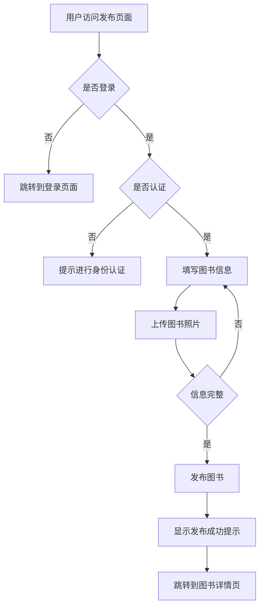

#### 需求 6：图书编辑
**用户故事：** 作为图书发布者，我希望能够编辑已发布的图书信息，以便更新图书状态或修正错误

##### 验收标准
1. 图书发布者应当能够访问自己发布的图书编辑页面
2. 用户应当能够修改图书信息（价格、描述、状态等）
3. 用户修改信息后，系统应当保存并更新显示
4. 图书已成交或下架后，用户应当无法编辑

> ##### 类型：状态驱动
##### 处理逻辑：
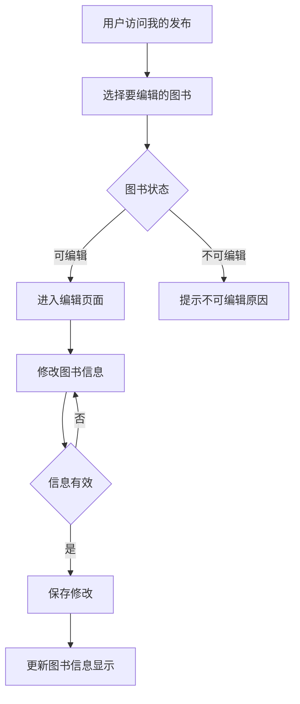

#### 需求 7：图书删除
**用户故事：** 作为图书发布者，我希望能够删除已发布的图书信息，以便在图书卖出或不再出售时移除信息

##### 验收标准
1. 图书发布者应当能够删除自己发布的图书
2. 用户删除图书时，系统应当提示确认
3. 图书删除后，系统应当从列表中移除并不再显示
4. 已成交的图书，用户应当无法删除

> ##### 类型：事件驱动
##### 处理逻辑：
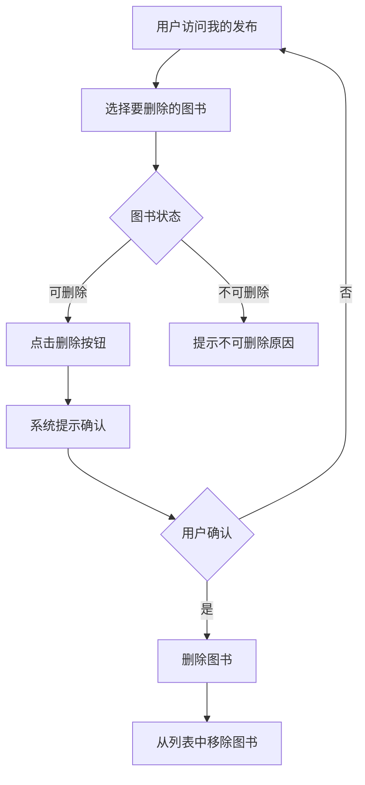

#### 需求 8：图书搜索
**用户故事：** 作为用户，我希望能够搜索图书，以便快速找到我需要的二手图书

##### 验收标准
1. 用户应当能够在首页或搜索页面输入关键词搜索图书
2. 系统应当支持按书名、作者、ISBN等进行搜索
3. 搜索结果应当按相关性或最新发布时间排序
4. 用户应当能够筛选搜索结果（按价格、 condition等）
5. 无搜索结果时，系统应当显示提示信息

> ##### 类型：通用性
##### 处理逻辑：
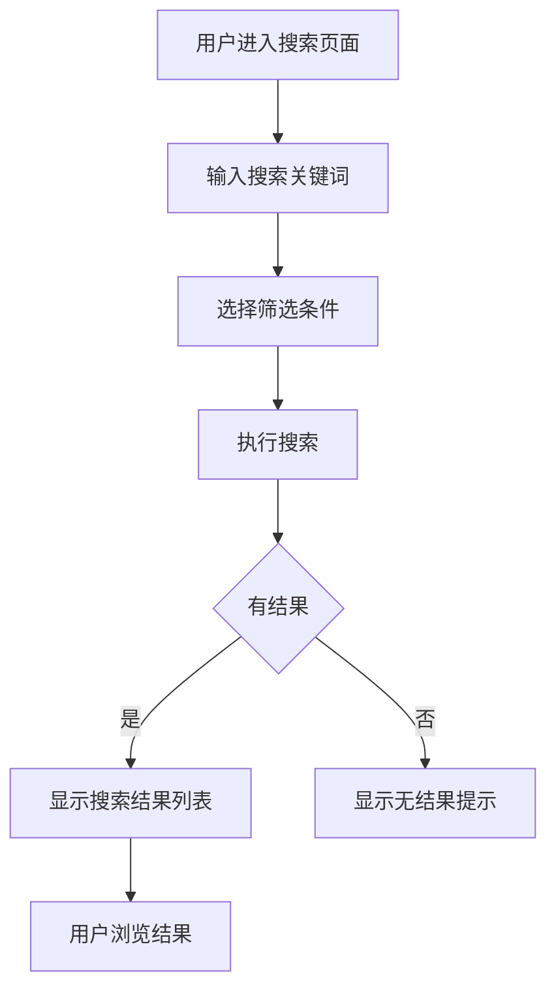

#### 需求 9：图书分类
**用户故事：** 作为用户，我希望能够按分类浏览图书，以便更高效地找到感兴趣的图书

##### 验收标准
1. 系统应当提供图书分类导航
2. 图书应当至少按学科、教材/非教材等进行分类
3. 用户点击分类后，系统应当显示该分类下的图书列表
4. 用户应当能够在分类下进一步筛选（如按价格、新旧程度等）

> ##### 类型：条件驱动
##### 处理逻辑：
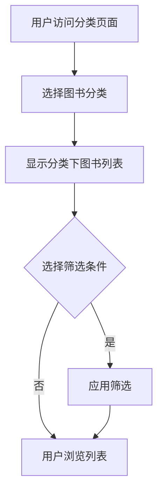

### 3.3 交易管理模块

#### 需求 10：商品浏览
**用户故事：** 作为用户，我希望能够浏览图书详情，以便了解图书信息并决定是否购买

##### 验收标准
1. 用户点击图书列表中的图书后，系统应当显示图书详情页
2. 图书详情页应当包含图书基本信息、价格、卖家信息、图书状态、照片等
3. 图书详情页应当提供联系卖家、加入收藏、立即购买等按钮
4. 用户应当能够查看图书的历史交易记录（如已售出数量）

> ##### 类型：通用性
##### 处理逻辑：
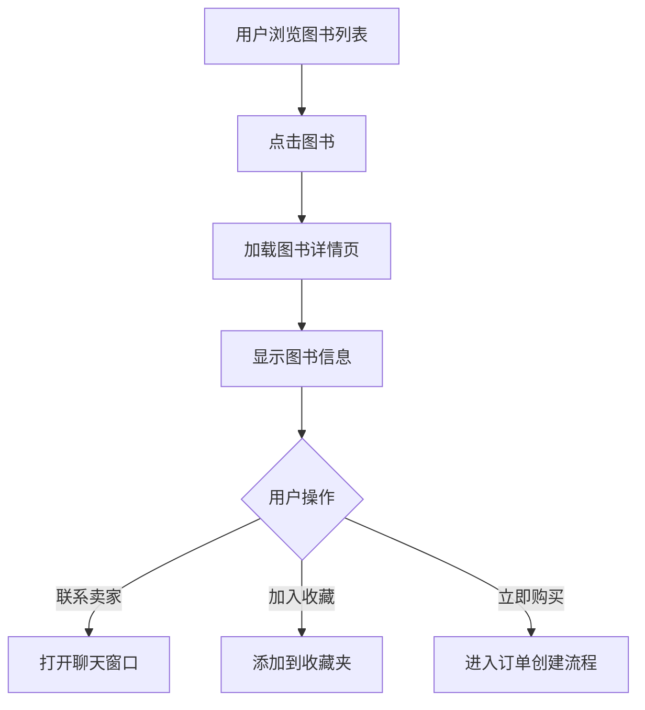

#### 需求 11：加入收藏
**用户故事：** 作为用户，我希望能够收藏感兴趣的图书，以便稍后查看或购买

##### 验收标准
1. 图书详情页应当有加入收藏按钮
2. 用户点击加入收藏后，系统应当提示收藏成功
3. 已收藏的图书，按钮应当变为已收藏状态
4. 用户应当能够在个人中心查看收藏的图书
5. 用户应当能够取消收藏

> ##### 类型：事件驱动
##### 处理逻辑：
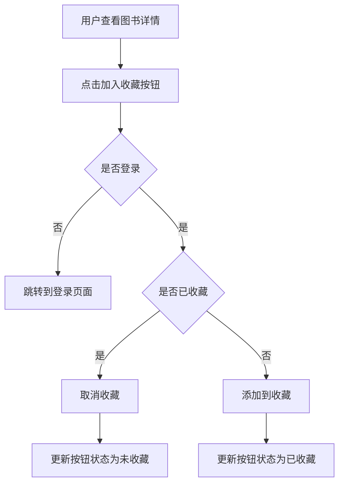

#### 需求 12：订单创建
**用户故事：** 作为买家，我希望能够创建订单，以便购买心仪的图书

##### 验收标准
1. 用户点击立即购买后，系统应当进入订单创建页面
2. 订单创建页面应当显示图书信息、价格、卖家信息等
3. 用户应当能够选择交易方式（自提）和时间
4. 用户确认订单信息后，系统应当生成订单并进入支付流程

> ##### 类型：事件驱动
##### 处理逻辑：
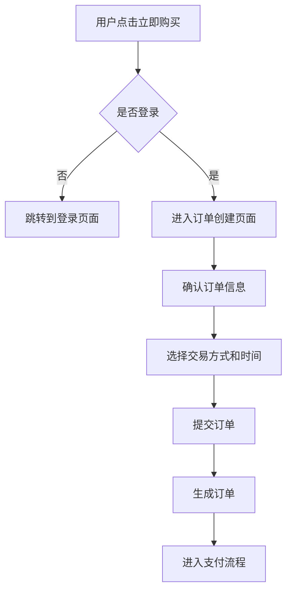

#### 需求 13：支付流程
**用户故事：** 作为买家，我希望能够便捷地支付订单，以便完成交易

##### 验收标准
1. 订单生成后，系统应当提供支付入口
2. 系统应当支持多种支付方式（如微信支付、支付宝等）
3. 用户支付成功后，系统应当显示支付成功提示并更新订单状态
4. 支付失败时，系统应当提示失败原因并提供重试选项
5. 订单超时未支付，系统应当自动取消订单

> ##### 类型：事件驱动
##### 处理逻辑：
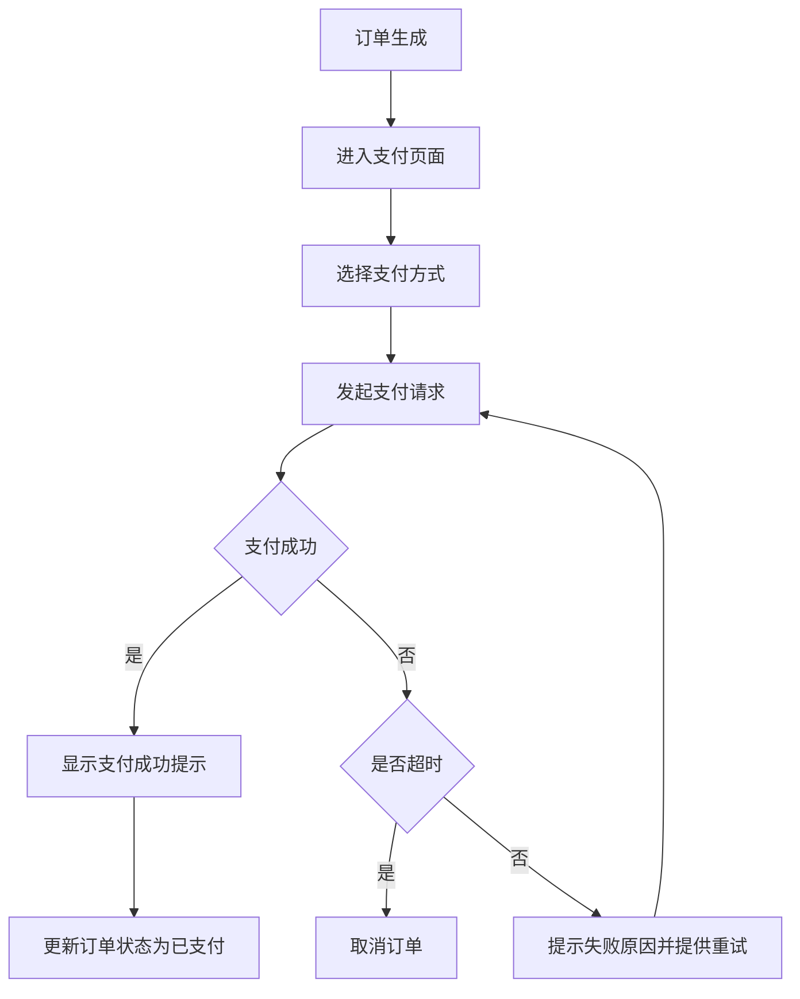

#### 需求 14：自提流程
**用户故事：** 作为买家/卖家，我希望能够便捷地完成自提交易，确保交易安全

##### 验收标准
1. 支付成功后，系统应当显示自提信息（时间、地点等）
2. 卖家应当能够确认买家已取货
3. 买家取货后，应当能够确认收货
4. 交易完成后，系统应当更新订单状态为已完成
5. 系统应当提供交易纠纷处理机制

> ##### 类型：状态驱动
##### 处理逻辑：
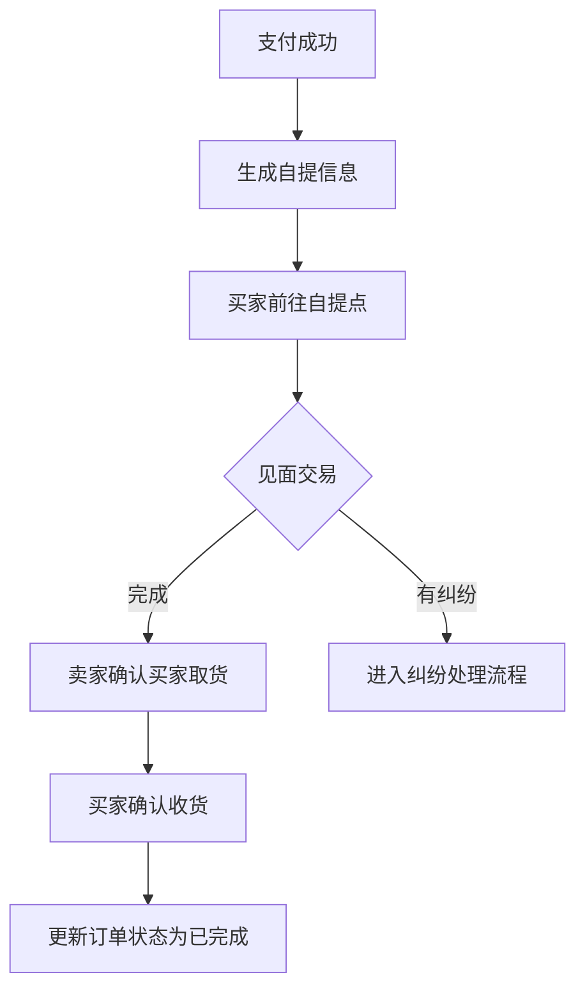

#### 需求 15：交易评价
**用户故事：** 作为买家/卖家，我希望能够对交易进行评价，以便分享交易体验

##### 验收标准
1. 交易完成后，系统应当提示双方进行评价
2. 用户应当能够对交易进行评分（如1-5星）和文字评价
3. 用户应当能够上传交易相关照片
4. 评价发布后，系统应当显示在双方的信用记录中
5. 用户应当能够查看其他用户的评价历史

> ##### 类型：事件驱动
##### 处理逻辑：
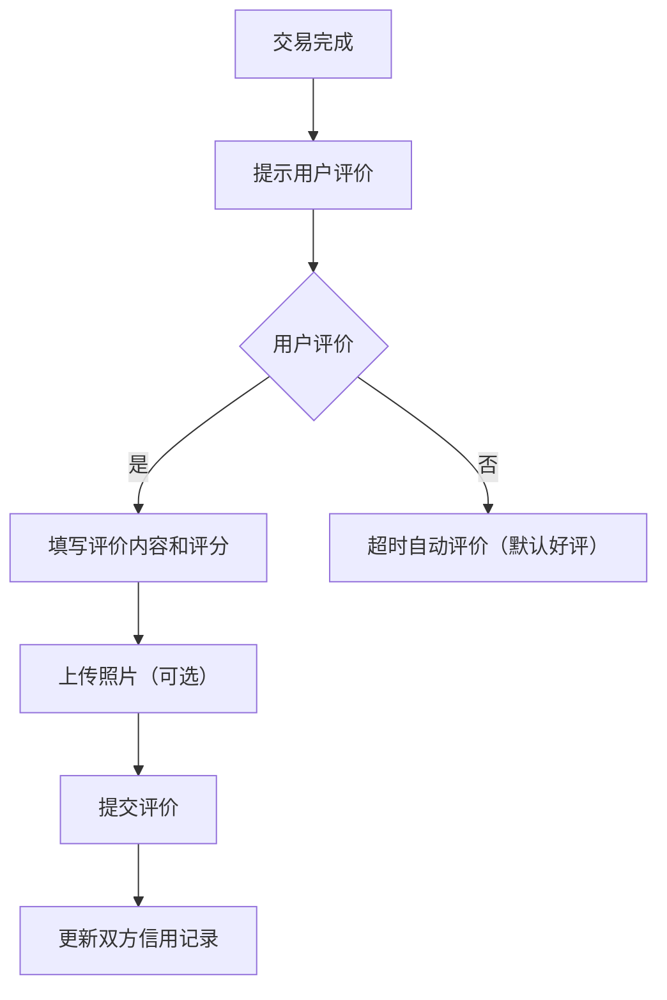

### 3.4 消息通知模块

#### 需求 16：聊天功能
**用户故事：** 作为用户，我希望能够与其他用户进行聊天，以便沟通交易细节

##### 验收标准
1. 用户应当能够在图书详情页或用户主页发起聊天
2. 系统应当支持文本、图片等多种消息类型
3. 消息应当实时送达并显示已读/未读状态
4. 用户应当能够查看聊天历史记录
5. 用户应当能够在聊天中发送图书链接

> ##### 类型：事件驱动
##### 处理逻辑：
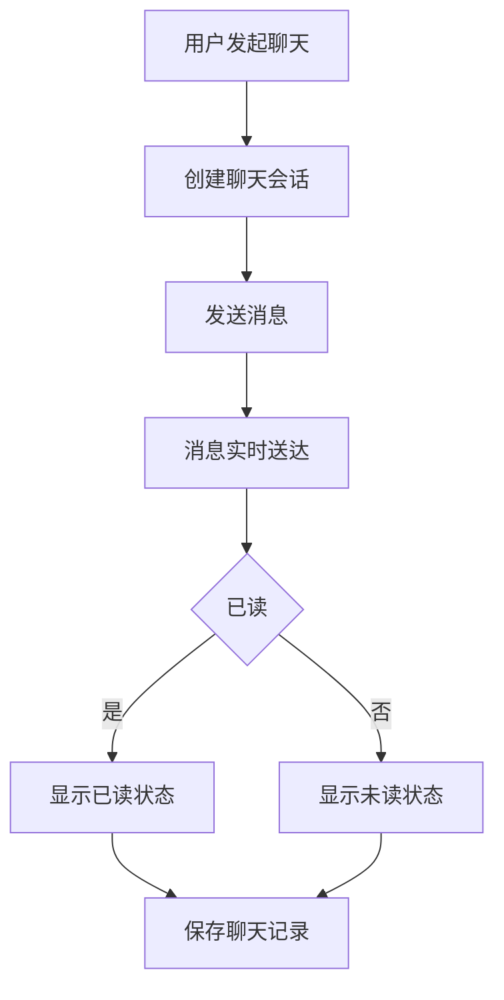

#### 需求 17：系统通知
**用户故事：** 作为用户，我希望能够接收系统通知，以便了解平台动态和重要信息

##### 验收标准
1. 系统应当向用户推送重要通知（如规则更新、活动通知等）
2. 通知应当包含标题、内容和相关链接
3. 用户应当能够查看通知历史
4. 系统应当标记未读通知
5. 用户应当能够删除通知

> ##### 类型：通用性
##### 处理逻辑：
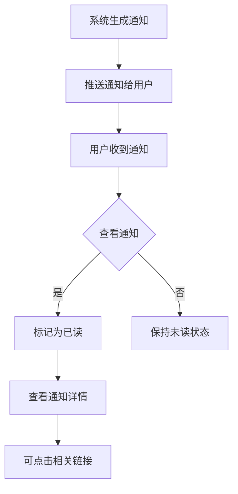

#### 需求 18：交易提醒
**用户故事：** 作为用户，我希望能够接收交易提醒，以便及时了解交易状态变化

##### 验收标准
1. 当交易状态发生变化时（如订单创建、支付、发货、确认收货等），系统应当发送提醒
2. 提醒应当包含交易状态、订单编号和相关操作按钮
3. 用户点击提醒应当能够跳转到对应的订单详情页
4. 系统应当支持多种提醒方式（如站内信、短信等）

> ##### 类型：状态驱动
##### 处理逻辑：
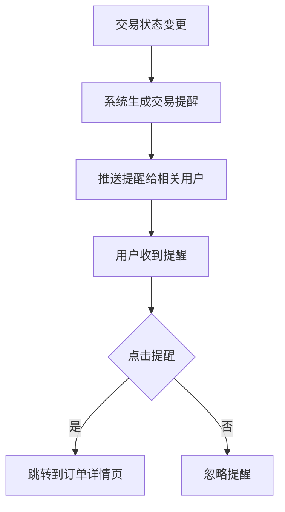

#### 需求 19：消息设置
**用户故事：** 作为用户，我希望能够设置消息接收偏好，以便控制消息提醒方式和频率

##### 验收标准
1. 用户应当能够在个人中心找到消息设置选项
2. 用户应当能够开启/关闭不同类型的消息提醒
3. 用户应当能够选择消息接收方式（如站内信、短信等）
4. 用户应当能够设置消息免打扰时间段

> ##### 类型：可选功能
##### 处理逻辑：
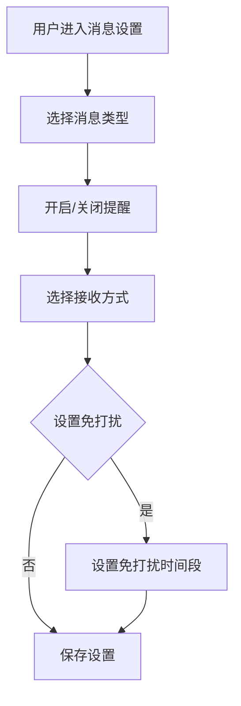

## 4. 非功能需求
### 4.1 性能指标
| 场景                | 要求                              | 验证方式                                  |
| ------------------- | --------------------------------- | ----------------------------------------- |
| 首页加载            | 首次加载≤2秒，缓存后加载≤1秒      | 浏览器开发者工具测量，Loadrunner压力测试  |
| 图书列表加载        | 列表页首次加载≤1.5秒，翻页≤1秒    | 浏览器开发者工具测量，JMeter压力测试      |
| 搜索响应            | 关键词搜索响应时间≤1秒，筛选≤1.5秒 | 后端API性能测试，模拟多用户并发搜索        |
| 并发处理            | 支持1000用户并发访问，响应时间≤2秒 | Loadrunner模拟1000用户并发访问            |
| 数据查询性能        | 复杂查询（多条件筛选）≤2秒        | 数据库性能测试工具，执行复杂SQL查询        |
| 图片加载            | 图书封面图加载≤1秒，缩略图≤0.5秒  | 图片CDN性能测试，浏览器缓存策略验证        |
| 支付流程            | 支付请求响应时间≤3秒              | 支付接口性能测试，模拟真实支付场景          |

### 4.2 安全需求
- 🔒 用户密码必须使用bcrypt或Argon2算法加密存储，禁止明文存储
- 🔒 系统必须实现基于JWT的身份验证机制，Token有效期不超过24小时
- 🔒 所有表单输入必须进行服务器端验证，防止XSS攻击
- 🔒 数据库查询必须使用参数化查询，防止SQL注入攻击
- 🔒 敏感数据（如用户身份证号、银行卡信息）必须进行加密传输和存储
- 🔒 系统必须实现CSRF防护机制
- 🔒 系统必须记录安全相关日志（如登录失败、异常访问等），日志保存期至少90天
- 🔒 系统必须实现权限控制机制，不同角色拥有不同操作权限
- 🔒 支付相关功能必须符合PCI DSS标准
- 🔒 定期进行安全漏洞扫描和渗透测试

### 4.3 兼容性
| 平台         | 支持版本                              |
| ------------ | ------------------------------------- |
| 浏览器       | Chrome 80+, Firefox 75+, Safari 13+, Edge 80+ |
| 操作系统     | Windows 10+, macOS 11+, Linux Ubuntu 20.04+ |
| 移动设备     | iOS 13+, Android 9+                   |
| 屏幕分辨率   | 支持1024×768及以上分辨率，响应式设计  |
| 网络环境     | 支持2G/3G/4G/5G/Wi-Fi网络环境         |