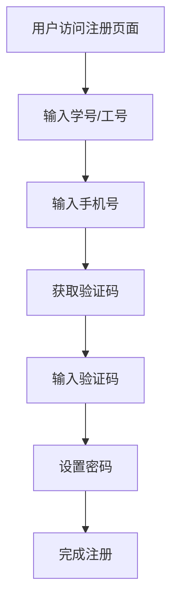
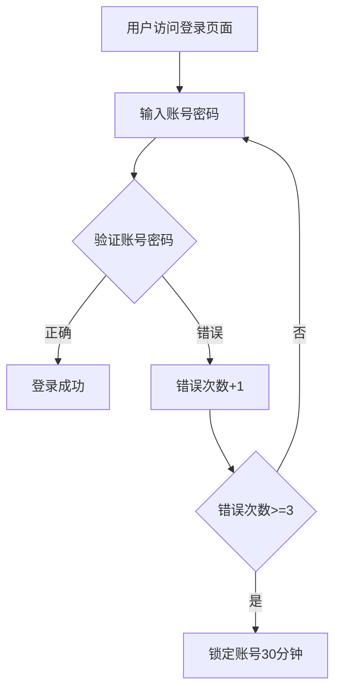
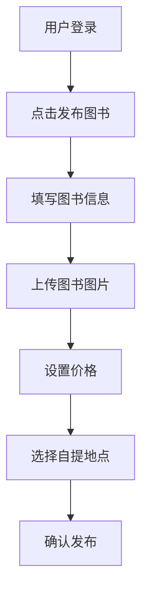
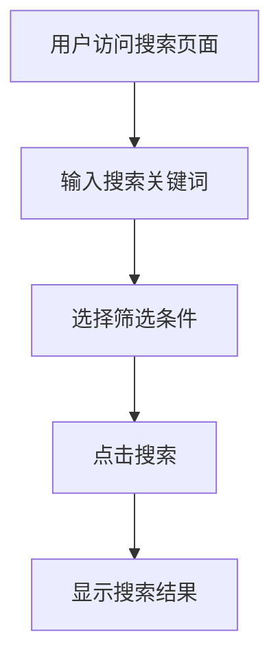
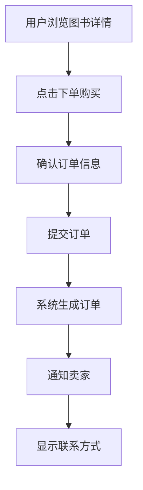
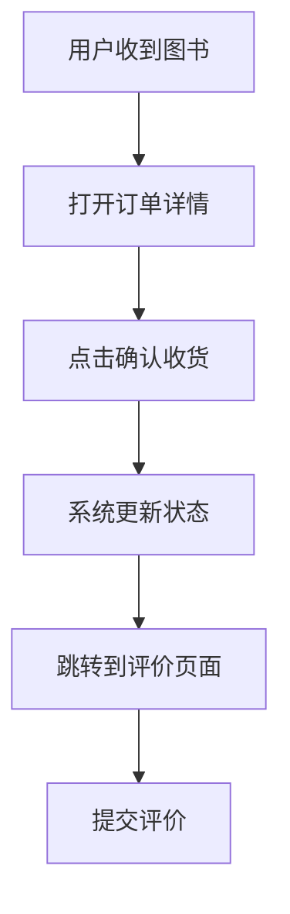
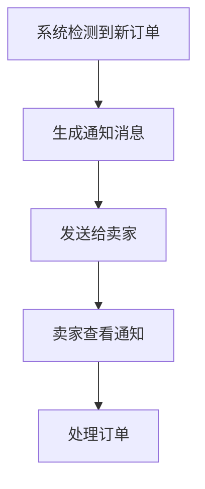
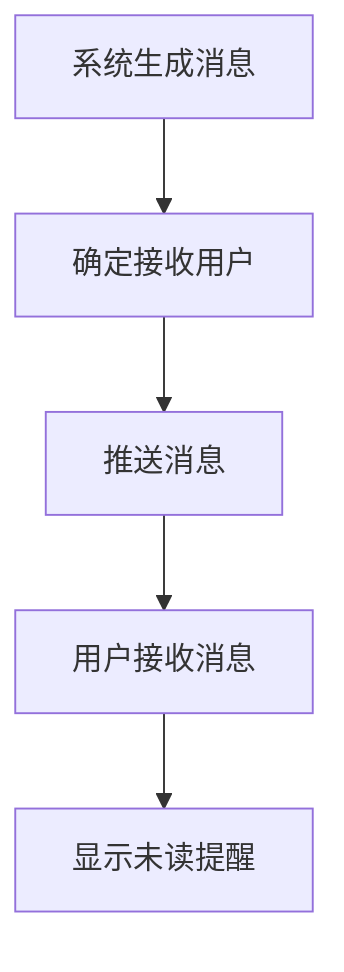
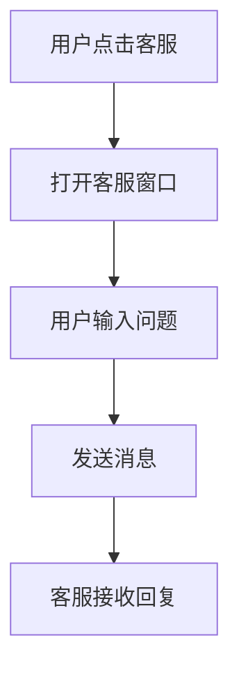
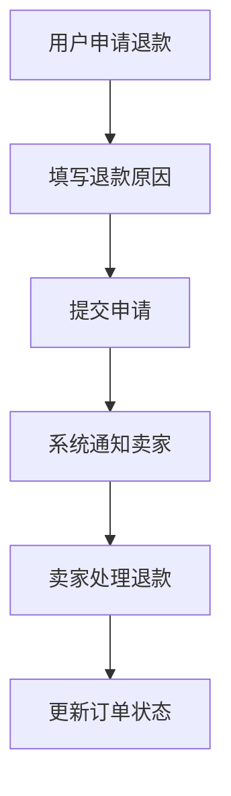

# 1. 核心需求
从程序员的角度描述要开发的需求内容，要求简洁明了。

开发一个校园二手图书交易商城，采用类似闲鱼APP的自提自付款交易模式。系统需要提供用户注册登录、图书发布管理、搜索浏览、下单交易、消息通知等核心功能，支持校园内的二手图书交易，确保交易安全可靠，用户体验流畅。

## 2. 技术约束

| 类型 | 约束条件            |
| ---- | ------------------- |
| 前端 | arco.design vue版本 |
| 后端 | FastApi+SQLModel    |
| 部署 | MySQL9.3.0          |

数据库连接信息：
- 主机：localhost
- 端口：3306
- 用户名：root
- 密码：root

数据库连接信息：
- 主机：localhost
- 端口：3306
- 用户名：root
- 密码：root

## 3. 需求功能

### 3.1 用户管理模块

#### 需求 1： 用户注册
**用户故事：** 作为[校园用户]，我希望[注册账号]以便[使用二手图书交易功能]

##### 验收标准
1. [用户提供有效学号/工号]，系统应当[创建用户账号]
2. [用户提供手机号和验证码]，系统应当[验证并绑定手机号]

> ##### 类型：事件驱动
##### 处理逻辑：  

#### 需求 2： 用户登录
**用户故事：** 作为[注册用户]，我希望[登录账号]以便[访问个人中心和交易功能]

##### 验收标准
1. [用户输入正确账号密码]，系统应当[允许登录并跳转首页]
2. [用户输入错误密码3次]，系统应当[锁定账号30分钟]

> ##### 类型：事件驱动
##### 处理逻辑：  

### 3.2 图书管理模块

#### 需求 3： 图书发布
**用户故事：** 作为[卖家用户]，我希望[发布二手图书信息]以便[其他用户可以看到并购买]

##### 验收标准
1. [用户登录并填写完整图书信息]，系统应当[发布图书到商城]
2. [用户上传图书图片]，系统应当[保存图片并生成缩略图]

> ##### 类型：事件驱动
##### 处理逻辑：  

#### 需求 4： 图书搜索
**用户故事：** 作为[买家用户]，我希望[搜索图书]以便[快速找到想要的图书]

##### 验收标准
1. [用户输入关键词]，系统应当[显示相关图书列表]
2. [用户选择筛选条件]，系统应当[按条件过滤图书]

> ##### 类型：通用性
##### 处理逻辑：  

### 3.3 交易管理模块

#### 需求 5： 下单购买
**用户故事：** 作为[买家用户]，我希望[下单购买图书]以便[锁定图书并联系卖家]

##### 验收标准
1. [用户选择图书并确认下单]，系统应当[生成订单并通知卖家]
2. [用户下单成功]，系统应当[显示卖家联系方式和自提地点]

> ##### 类型：事件驱动
##### 处理逻辑：  

#### 需求 6： 确认收货
**用户故事：** 作为[买家用户]，我希望[确认收货]以便[完成交易并评价卖家]

##### 验收标准
1. [用户收到图书并确认]，系统应当[更新订单状态为已完成]
2. [交易完成后]，系统应当[允许用户评价卖家]

> ##### 类型：状态驱动
##### 处理逻辑：  

### 3.4 消息通知模块

#### 需求 7： 订单通知
**用户故事：** 作为[卖家用户]，我希望[收到订单通知]以便[及时处理订单]

##### 验收标准
1. [有新订单时]，系统应当[发送通知给卖家]
2. [订单状态变更时]，系统应当[通知相关用户]

> ##### 类型：事件驱动
##### 处理逻辑：  

#### 需求 8： 系统消息
**用户故事：** 作为[系统用户]，我希望[接收系统消息]以便[了解平台动态和重要信息]

##### 验收标准
1. [系统有重要公告]，系统应当[推送消息给所有用户]
2. [用户有未读消息]，系统应当[显示消息提醒]

> ##### 类型：通用性
##### 处理逻辑：  

### 3.5 客服与售后模块

#### 需求 9： 客服入口
**用户故事：** 作为[系统用户]，我希望[有客服入口]以便[在遇到问题时能够获得帮助]

##### 验收标准
1. [用户点击客服按钮]，系统应当[打开客服对话窗口]
2. [用户发送消息]，系统应当[将消息转发给客服人员]

> ##### 类型：通用性
##### 处理逻辑：  

#### 需求 10： 退款流程
**用户故事：** 作为[买家用户]，我希望[申请退款]以便[在交易出现问题时能够退款]

##### 验收标准
1. [用户申请退款]，系统应当[创建退款申请并通知卖家]
2. [卖家同意退款]，系统应当[更新订单状态为退款中]

> ##### 类型：事件驱动
##### 处理逻辑：  

### 3.5 客服与售后模块

#### 需求 9： 客服入口
**用户故事：** 作为[系统用户]，我希望[有客服入口]以便[在遇到问题时能够获得帮助]

##### 验收标准
1. [用户点击客服按钮]，系统应当[打开客服对话窗口]
2. [用户发送消息]，系统应当[将消息转发给客服人员]

> ##### 类型：通用性
##### 处理逻辑：  

#### 需求 10： 退款流程
**用户故事：** 作为[买家用户]，我希望[申请退款]以便[在交易出现问题时能够退款]

##### 验收标准
1. [用户申请退款]，系统应当[创建退款申请并通知卖家]
2. [卖家同意退款]，系统应当[更新订单状态为退款中]

> ##### 类型：事件驱动
##### 处理逻辑：  

## 4. 非功能需求
### 4.1 性能指标
| 场景      | 要求         | 验证方式     |
| --------- | ------------ | ------------ |
| 页面加载  | <2秒         | 性能测试工具 |
| 搜索响应  | <1秒         | 压力测试     |
| 并发用户  | 支持1000并发 | 负载测试     |
| 图片上传  | <3秒         | 功能测试     |
| 消息推送  | <500ms       | 性能监控     |

### 4.2 安全需求
- 🔒 密码强度策略 (至少8位，包含字母和数字)
- 🔒 SQL注入防护
- 🔒 XSS攻击防护
- 🔒 用户数据加密存储
- 🔒 防CSRF攻击
- 🔒 文件上传安全检查
- 🔒 敏感信息脱敏显示
- 🔒 操作日志记录

### 4.3 兼容性
| 平台      | 支持版本     |
| --------- | ------------ |
| 浏览器    | Chrome 80+, Firefox 75+, Safari 13+ |
| 移动端    | iOS 12+, Android 8+ |
| 分辨率    | 适配1920x1080及以上 |
| 网络环境  | 支持WiFi和4G/5G网络 |