# 校园二手图书交易商城需求说明

## 1. 核心需求
开发一个面向校园用户的二手图书交易平台，采用类似闲鱼的C2C交易模式。平台核心功能包括：用户身份认证（学生身份验证）、图书信息发布与管理、基于地理位置的搜索发现、即时通讯、线下面交易（自提自付款）、交易评价与信誉体系。系统需支持移动端优先的响应式设计，确保学生用户可以便捷地完成图书的买卖交易。

## 2. 技术约束

| 类型 | 约束条件            |
| ---- | ------------------- |
| 前端 | Arco Design Vue 2.x版本，Vue 3.x，TypeScript 4.x |
| 后端 | FastAPI 0.104+，SQLModel 0.14+，Python 3.11+ |
| 数据库 | MySQL 9.3.0，连接信息：主机localhost:3306，用户root，密码root |
| 部署 | Docker容器化部署，支持Nginx反向代理 |
| 文件存储 | 本地文件系统存储图片，支持最大10MB/张 |
| 缓存 | Redis 7.x用于会话存储和热点数据缓存 |

## 3. 需求功能

### 3.1 用户管理模块

#### 需求 1：学生用户注册
**用户故事：** 作为在校学生，我希望通过学号和学校邮箱注册账号，以便获得平台的使用权限。

##### 验收标准
1. 当用户输入有效的学号（符合学校格式）和邮箱时，系统应当向该邮箱发送验证码
2. 当用户输入正确的邮箱验证码后，系统应当创建用户账户并跳转到个人信息完善页面
3. 当用户输入已注册的学号时，系统应当提示"该学号已注册"

> ##### 类型：通用性
##### 处理逻辑：
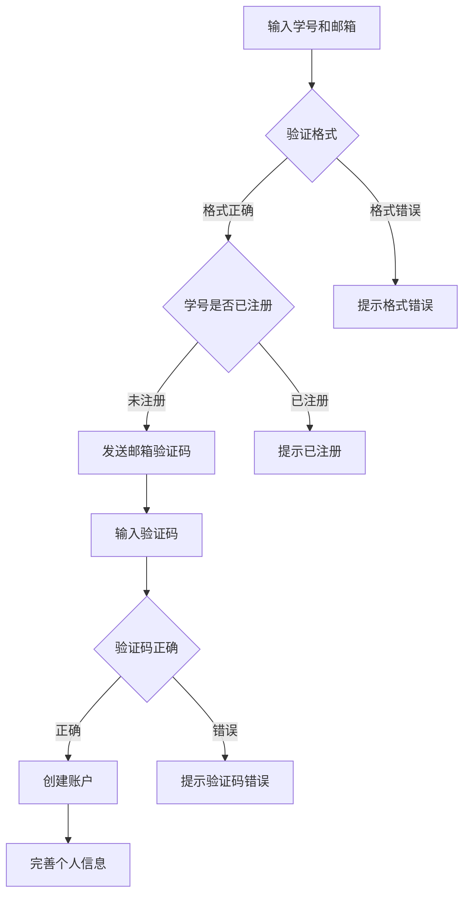
```mermaid
graph TD
    A[输入学号和邮箱] --> B{验证格式}
    B -->|格式正确| C{学号是否已注册}
    B -->|格式错误| D[提示格式错误]
    C -->|未注册| E[发送邮箱验证码]
    C -->|已注册| F[提示已注册]
    E --> G[输入验证码]
    G --> H{验证码正确}
    H -->|正确| I[创建账户]
    H -->|错误| J[提示验证码错误]
    I --> K[完善个人信息]
```

#### 需求 2：学生身份认证
**用户故事：** 作为在校学生，我希望通过上传学生证照片完成身份认证，以便获得更高的交易信誉。

##### 验收标准
1. 当用户上传清晰的学生证照片后，系统应当在24小时内完成人工审核
2. 当身份认证通过后，系统应当在用户头像旁显示"已认证"标识
3. 当身份认证被拒绝时，系统应当显示拒绝原因并允许重新提交

> ##### 类型：状态驱动
##### 处理逻辑：
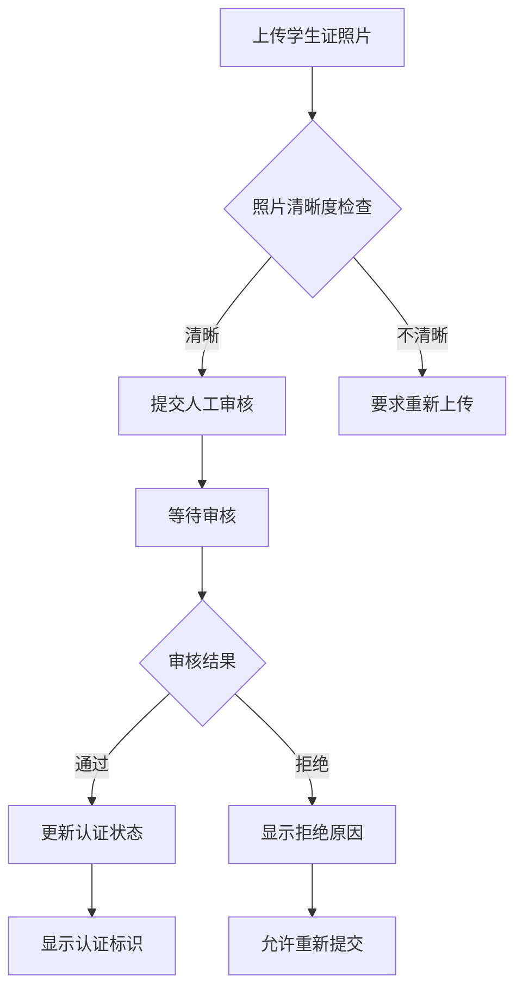
```mermaid
graph TD
    A[上传学生证照片] --> B{照片清晰度检查}
    B -->|清晰| C[提交人工审核]
    B -->|不清晰| D[要求重新上传]
    C --> E[等待审核]
    E --> F{审核结果}
    F -->|通过| G[更新认证状态]
    F -->|拒绝| H[显示拒绝原因]
    H --> I[允许重新提交]
    G --> J[显示认证标识]
```

#### 需求 3：个人信息管理
**用户故事：** 作为注册用户，我希望管理我的个人信息，以便其他用户了解我的信誉和联系方式。

##### 验收标准
1. 当用户编辑个人信息时，系统应当允许修改昵称、头像、联系电话、微信二维码
2. 当用户修改联系电话时，系统应当发送短信验证码进行验证
3. 当用户保存修改后，系统应当立即更新个人主页信息

> ##### 类型：通用性
##### 处理逻辑：
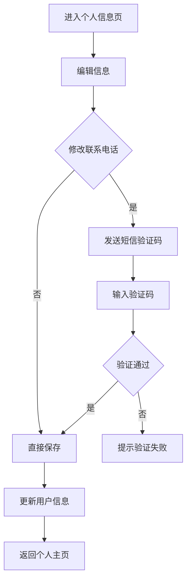
```mermaid
graph TD
    A[进入个人信息页] --> B[编辑信息]
    B --> C{修改联系电话}
    C -->|是| D[发送短信验证码]
    C -->|否| E[直接保存]
    D --> F[输入验证码]
    F --> G{验证通过}
    G -->|是| E
    G -->|否| H[提示验证失败]
    E --> I[更新用户信息]
    I --> J[返回个人主页]
```

### 3.2 图书信息管理模块

#### 需求 4：图书信息发布
**用户故事：** 作为卖家，我希望发布二手图书信息，以便让买家看到我的图书。

##### 验收标准
1. 当用户填写图书信息（书名、作者、ISBN、价格、成色、描述）并上传1-9张图片后，系统应当创建图书信息
2. 当用户输入ISBN时，系统应当自动获取图书基本信息（书名、作者、出版社、封面图）
3. 当用户设置价格超过200元时，系统应当提示"建议面交时验货"

> ##### 类型：通用性
##### 处理逻辑：
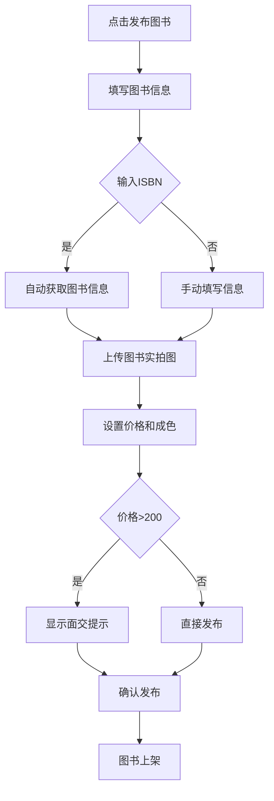
```mermaid
graph TD
    A[点击发布图书] --> B[填写图书信息]
    B --> C{输入ISBN}
    C -->|是| D[自动获取图书信息]
    C -->|否| E[手动填写信息]
    D --> F[上传图书实拍图]
    E --> F
    F --> G[设置价格和成色]
    G --> H{价格>200}
    H -->|是| I[显示面交提示]
    H -->|否| J[直接发布]
    I --> K[确认发布]
    J --> K
    K --> L[图书上架]
```

#### 需求 5：图书状态管理
**用户故事：** 作为卖家，我希望管理图书的销售状态，以便及时更新图书的可用性。

##### 验收标准
1. 当图书被下单后，系统应当自动将状态从"在售"改为"已预订"
2. 当买家确认收货后，系统应当将状态改为"已售出"
3. 当卖家主动下架时，系统应当将状态改为"已下架"

> ##### 类型：状态驱动
##### 处理逻辑：
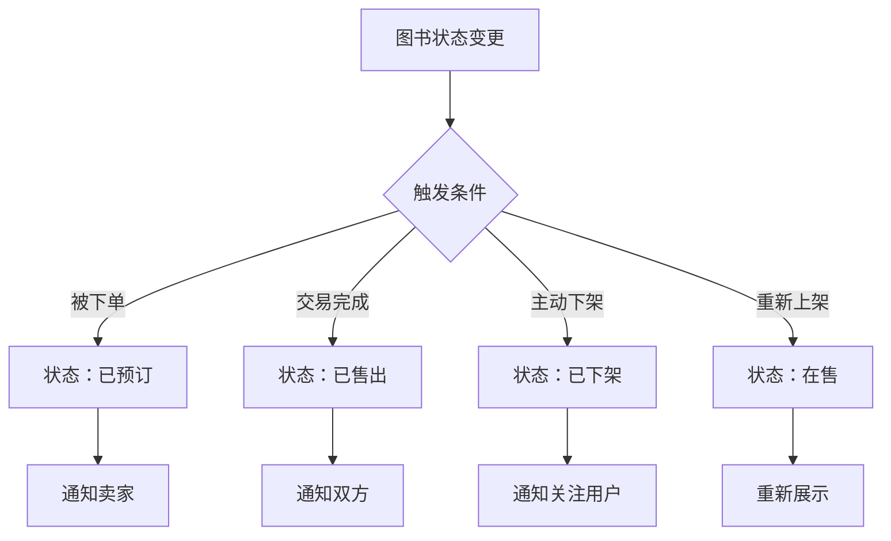
```mermaid
graph TD
    A[图书状态变更] --> B{触发条件}
    B -->|被下单| C[状态：已预订]
    B -->|交易完成| D[状态：已售出]
    B -->|主动下架| E[状态：已下架]
    B -->|重新上架| F[状态：在售]
    C --> G[通知卖家]
    D --> H[通知双方]
    E --> I[通知关注用户]
    F --> J[重新展示]
```

#### 需求 6：图书图片上传
**用户故事：** 作为卖家，我希望上传图书的实拍图片，以便买家了解图书的真实情况。

##### 验收标准
1. 当用户选择图片时，系统应当支持jpg、png格式，单张不超过10MB
2. 当用户上传图片后，系统应当自动生成缩略图和水印
3. 当用户上传超过9张图片时，系统应当提示"最多上传9张图片"

> ##### 类型：通用性
##### 处理逻辑：
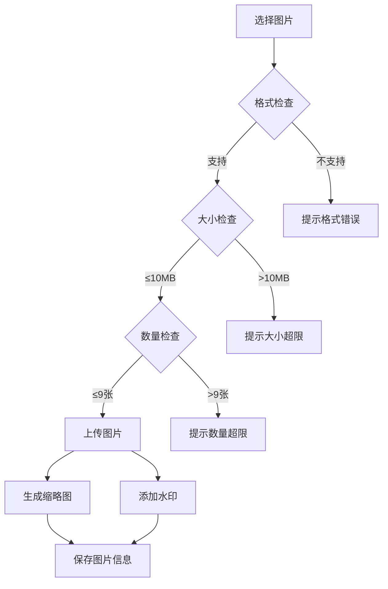
```mermaid
graph TD
    A[选择图片] --> B{格式检查}
    B -->|支持| C{大小检查}
    B -->|不支持| D[提示格式错误]
    C -->|≤10MB| E{数量检查}
    C -->|>10MB| F[提示大小超限]
    E -->|≤9张| G[上传图片]
    E -->|>9张| H[提示数量超限]
    G --> I[生成缩略图]
    G --> J[添加水印]
    I --> K[保存图片信息]
    J --> K
```

### 3.3 交易管理模块

#### 需求 7：下单购买
**用户故事：** 作为买家，我希望下单购买感兴趣的图书，以便与卖家约定交易。

##### 验收标准
1. 当用户点击"立即购买"时，系统应当生成包含图书信息、价格、交易地点的订单
2. 当订单生成后，系统应当向买卖双方发送订单确认通知
3. 当图书已被预订时，系统应当提示"该图书已被预订"

> ##### 类型：事件驱动
##### 处理逻辑：
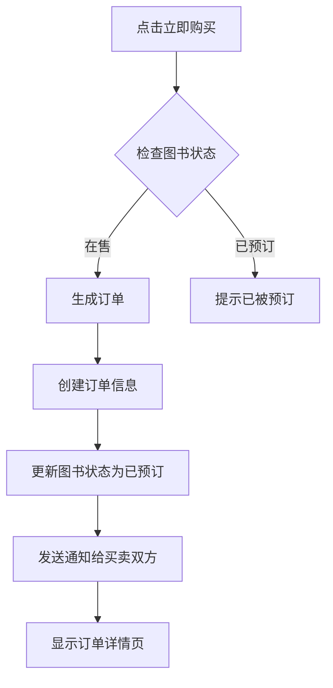
```mermaid
graph TD
    A[点击立即购买] --> B{检查图书状态}
    B -->|在售| C[生成订单]
    B -->|已预订| D[提示已被预订]
    C --> E[创建订单信息]
    E --> F[更新图书状态为已预订]
    F --> G[发送通知给买卖双方]
    G --> H[显示订单详情页]
```

#### 需求 8：自提码生成
**用户故事：** 作为交易双方，我希望通过自提码确认交易，以确保交易安全。

##### 验收标准
1. 当订单状态为"待自提"时，系统应当为买家生成6位数字自提码
2. 当面交时，当买家出示自提码，卖家输入后，系统应当验证自提码有效性
3. 当自提码验证成功后，系统应当更新订单状态为"已完成"

> ##### 类型：事件驱动
##### 处理逻辑：
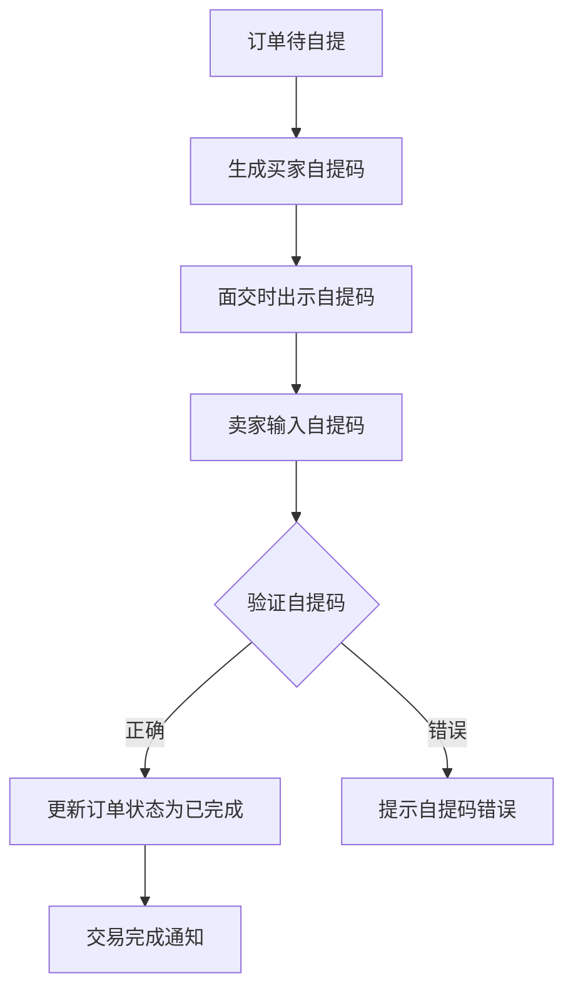
```mermaid
graph TD
    A[订单待自提] --> B[生成买家自提码]
    B --> C[面交时出示自提码]
    C --> D[卖家输入自提码]
    D --> E{验证自提码}
    E -->|正确| F[更新订单状态为已完成]
    E -->|错误| G[提示自提码错误]
    F --> H[交易完成通知]
```

#### 需求 9：订单管理
**用户故事：** 作为用户，我希望查看和管理我的所有订单，以便跟踪交易进度。

##### 验收标准
1. 当用户进入"我的订单"时，系统应当显示所有订单列表，按时间倒序排列
2. 当用户点击订单时，系统应当显示订单详情，包括图书信息、交易状态、对方联系方式
3. 当订单状态变更时，系统应当实时更新订单显示

> ##### 类型：通用性
##### 处理逻辑：
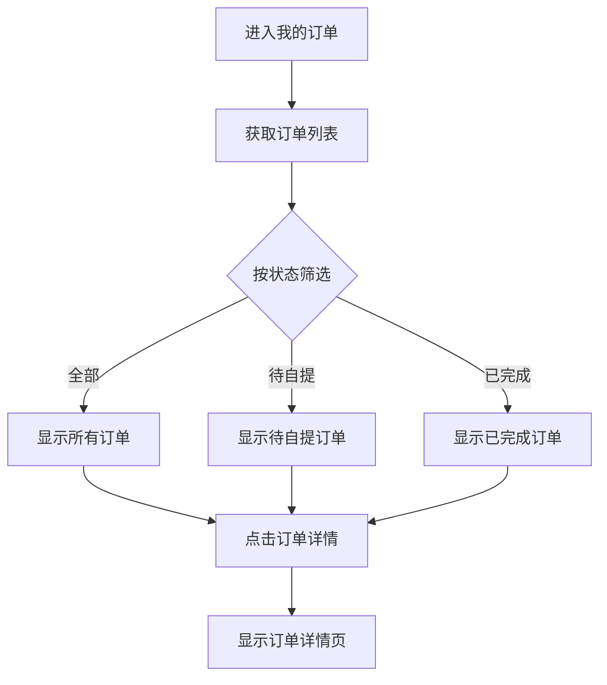
```mermaid
graph TD
    A[进入我的订单] --> B[获取订单列表]
    B --> C{按状态筛选}
    C -->|全部| D[显示所有订单]
    C -->|待自提| E[显示待自提订单]
    C -->|已完成| F[显示已完成订单]
    D --> G[点击订单详情]
    E --> G
    F --> G
    G --> H[显示订单详情页]
```

#### 需求 10：取消订单
**用户故事：** 作为买家，我希望在特定条件下取消订单，以便避免不必要的交易。

##### 验收标准
1. 当订单状态为"待自提"且未超过24小时，买家可以取消订单
2. 当订单取消后，系统应当将图书状态恢复为"在售"
3. 当订单取消后，系统应当向买卖双方发送取消通知

> ##### 类型：条件驱动
##### 处理逻辑：
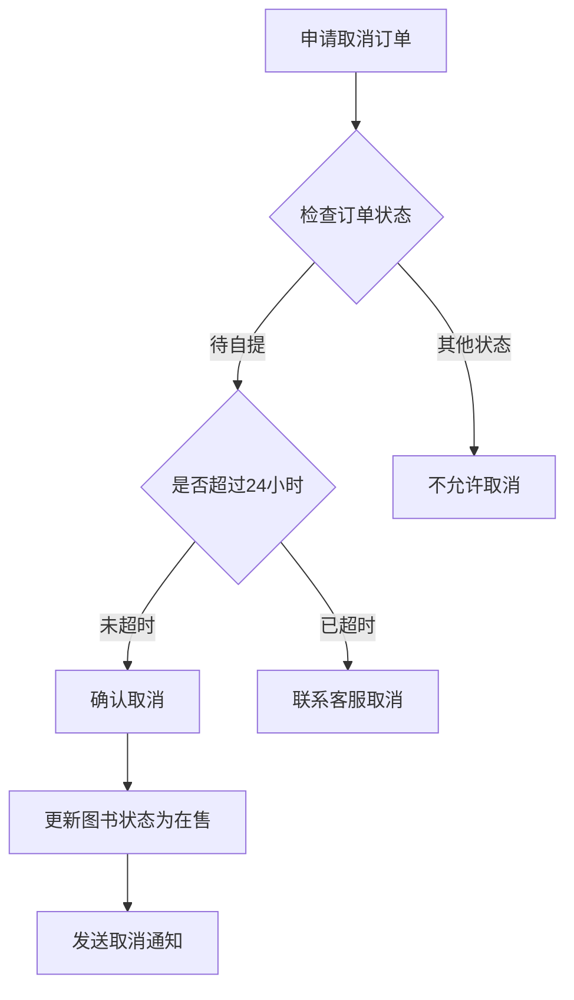
```mermaid
graph TD
    A[申请取消订单] --> B{检查订单状态}
    B -->|待自提| C{是否超过24小时}
    B -->|其他状态| D[不允许取消]
    C -->|未超时| E[确认取消]
    C -->|已超时| F[联系客服取消]
    E --> G[更新图书状态为在售]
    G --> H[发送取消通知]
```

### 3.4 搜索与发现模块

#### 需求 11：图书搜索
**用户故事：** 作为买家，我希望通过关键词搜索图书，以便快速找到需要的书籍。

##### 验收标准
1. 当用户输入关键词时，系统应当支持按书名、作者、ISBN进行模糊搜索
2. 当搜索无结果时，系统应当显示"未找到相关图书"并提供相似推荐
3. 当用户搜索时，系统应当显示搜索历史记录

> ##### 类型：通用性
##### 处理逻辑：
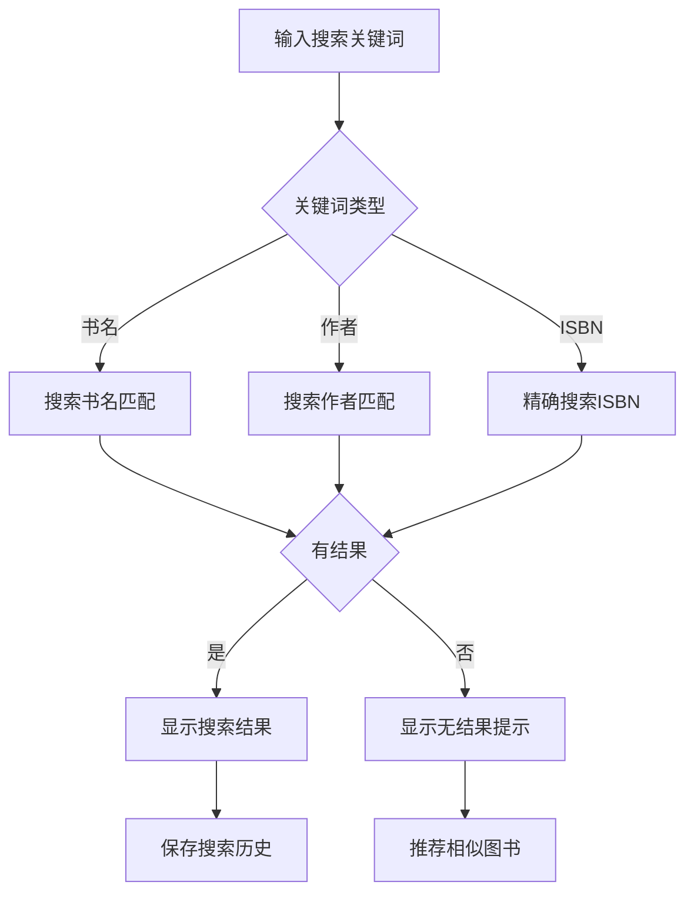
```mermaid
graph TD
    A[输入搜索关键词] --> B{关键词类型}
    B -->|书名| C[搜索书名匹配]
    B -->|作者| D[搜索作者匹配]
    B -->|ISBN| E[精确搜索ISBN]
    C --> F{有结果}
    D --> F
    E --> F
    F -->|是| G[显示搜索结果]
    F -->|否| H[显示无结果提示]
    H --> I[推荐相似图书]
    G --> J[保存搜索历史]
```

#### 需求 12：筛选与排序
**用户故事：** 作为买家，我希望通过筛选条件查找图书，以便找到符合需求的图书。

##### 验收标准
1. 当用户选择筛选条件时，系统应当支持按价格区间、图书成色、学院分类进行筛选
2. 当用户选择排序方式时，系统应当支持按价格升序/降序、发布时间排序
3. 当筛选条件变更时，系统应当实时更新搜索结果

> ##### 类型：条件驱动
##### 处理逻辑：
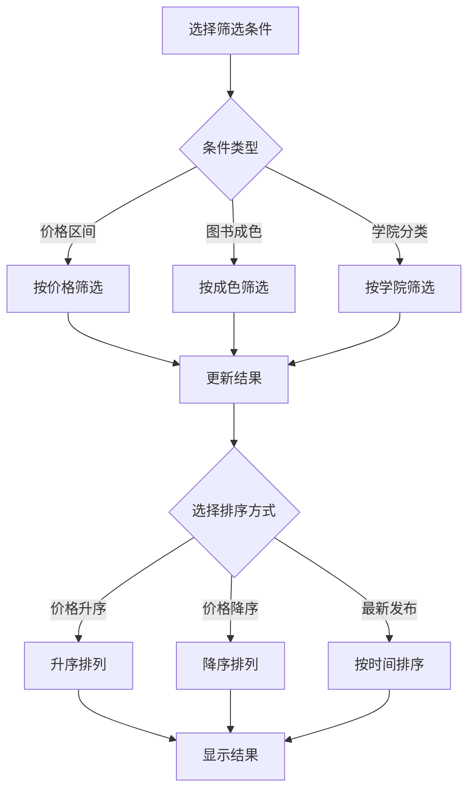
```mermaid
graph TD
    A[选择筛选条件] --> B{条件类型}
    B -->|价格区间| C[按价格筛选]
    B -->|图书成色| D[按成色筛选]
    B -->|学院分类| E[按学院筛选]
    C --> F[更新结果]
    D --> F
    E --> F
    F --> G{选择排序方式}
    G -->|价格升序| H[升序排列]
    G -->|价格降序| I[降序排列]
    G -->|最新发布| J[按时间排序]
    H --> K[显示结果]
    I --> K
    J --> K
```

#### 需求 13：基于地理位置的发现
**用户故事：** 作为买家，我希望发现附近的图书，以便减少取货距离。

##### 验收标准
1. 当用户授权位置权限后，系统应当显示5公里范围内的图书
2. 当用户拒绝位置权限时，系统应当提示手动选择学校区域
3. 当显示附近图书时，系统应当显示距离信息（如"距离您500米"）

> ##### 类型：条件驱动
##### 处理逻辑：
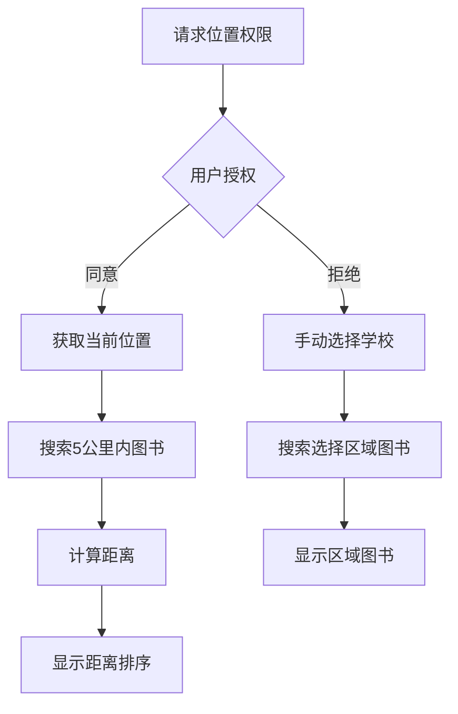
```mermaid
graph TD
    A[请求位置权限] --> B{用户授权}
    B -->|同意| C[获取当前位置]
    B -->|拒绝| D[手动选择学校]
    C --> E[搜索5公里内图书]
    D --> F[搜索选择区域图书]
    E --> G[计算距离]
    F --> H[显示区域图书]
    G --> I[显示距离排序]
```

#### 需求 14：图书推荐
**用户故事：** 作为买家，我希望看到推荐的图书，以便发现可能感兴趣的书籍。

##### 验收标准
1. 当用户浏览图书详情后，系统应当推荐同类型的其他图书
2. 当用户无搜索行为时，系统应当推荐热门图书和新上架图书
3. 当用户有购买历史时，系统应当基于历史偏好推荐图书

> ##### 类型：可选功能
##### 处理逻辑：
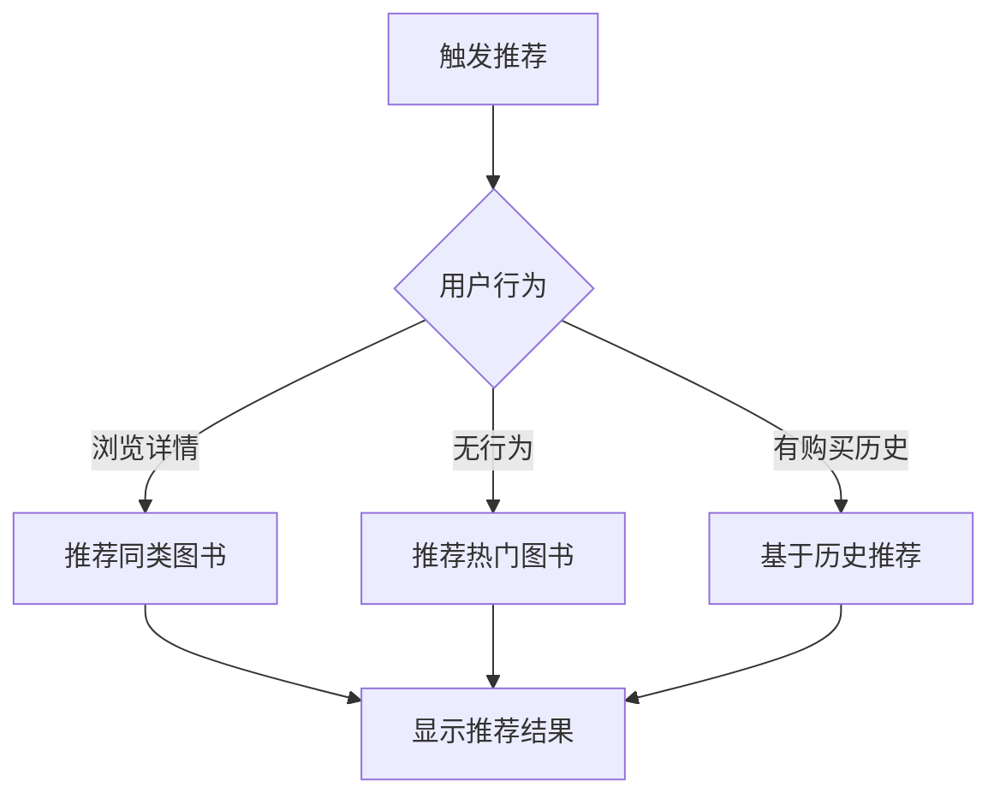
```mermaid
graph TD
    A[触发推荐] --> B{用户行为}
    B -->|浏览详情| C[推荐同类图书]
    B -->|无行为| D[推荐热门图书]
    B -->|有购买历史| E[基于历史推荐]
    C --> F[显示推荐结果]
    D --> F
    E --> F
```

### 3.5 消息通知模块

#### 需求 15：即时通讯
**用户故事：** 作为交易双方，我希望通过平台内聊天沟通交易细节，以便约定交易时间和地点。

##### 验收标准
1. 当用户点击"联系卖家"时，系统应当打开聊天窗口并显示历史消息
2. 当收到新消息时，系统应当在消息图标上显示未读数量
3. 当用户发送消息时，系统应当实时显示消息已发送状态

> ##### 类型：事件驱动
##### 处理逻辑：
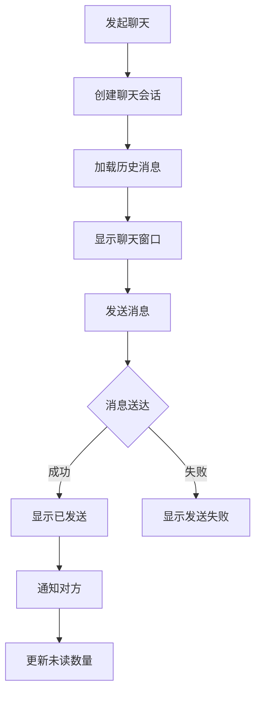
```mermaid
graph TD
    A[发起聊天] --> B[创建聊天会话]
    B --> C[加载历史消息]
    C --> D[显示聊天窗口]
    D --> E[发送消息]
    E --> F{消息送达}
    F -->|成功| G[显示已发送]
    F -->|失败| H[显示发送失败]
    G --> I[通知对方]
    I --> J[更新未读数量]
```

#### 需求 16：交易通知
**用户故事：** 作为用户，我希望及时收到交易状态变更的通知，以便了解交易进展。

##### 验收标准
1. 当订单状态变更时，系统应当向相关用户推送通知
2. 当收到新消息时，系统应当推送消息通知
3. 当用户设置免打扰时，系统应当只显示应用内通知不推送

> ##### 类型：事件驱动
##### 处理逻辑：
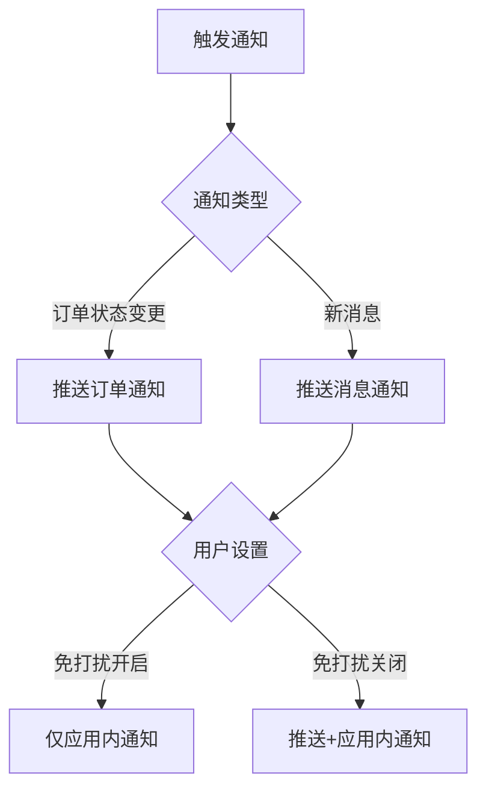
```mermaid
graph TD
    A[触发通知] --> B{通知类型}
    B -->|订单状态变更| C[推送订单通知]
    B -->|新消息| D[推送消息通知]
    C --> E{用户设置}
    D --> E
    E -->|免打扰开启| F[仅应用内通知]
    E -->|免打扰关闭| G[推送+应用内通知]
```

#### 需求 17：系统公告
**用户故事：** 作为用户，我希望查看平台公告和活动信息，以便了解平台最新动态。

##### 验收标准
1. 当有新的系统公告时，系统应当在首页显示公告入口
2. 当用户点击公告时，系统应当显示公告详情
3. 当公告为重要通知时，系统应当强制弹窗显示

> ##### 类型：可选功能
##### 处理逻辑：
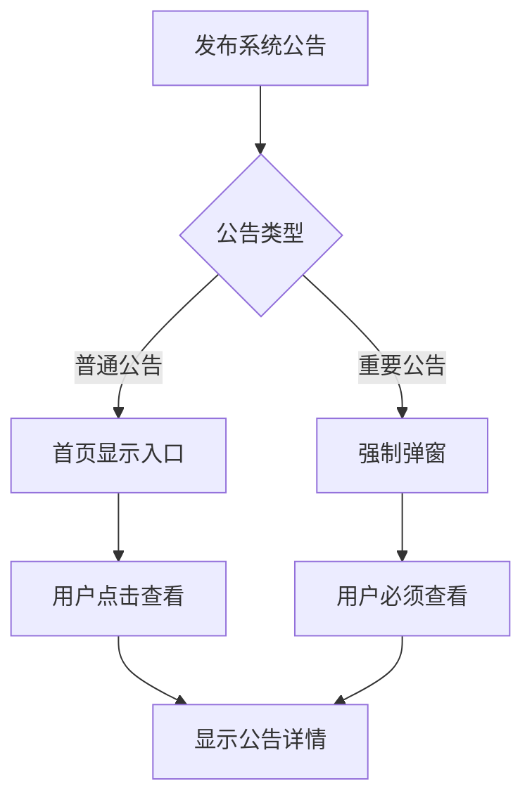
```mermaid
graph TD
    A[发布系统公告] --> B{公告类型}
    B -->|普通公告| C[首页显示入口]
    B -->|重要公告| D[强制弹窗]
    C --> E[用户点击查看]
    D --> F[用户必须查看]
    E --> G[显示公告详情]
    F --> G
```

### 3.6 评价与信誉模块

#### 需求 18：交易评价
**用户故事：** 作为交易双方，我希望在交易完成后互相评价，以便建立信誉体系。

##### 验收标准
1. 当订单状态变为"已完成"后，系统应当在24小时内开放评价入口
2. 当用户提交评价时，系统应当支持1-5星评分和文字评价
3. 当双方完成评价后，系统应当显示评价内容并更新信誉分数

> ##### 类型：事件驱动
##### 处理逻辑：
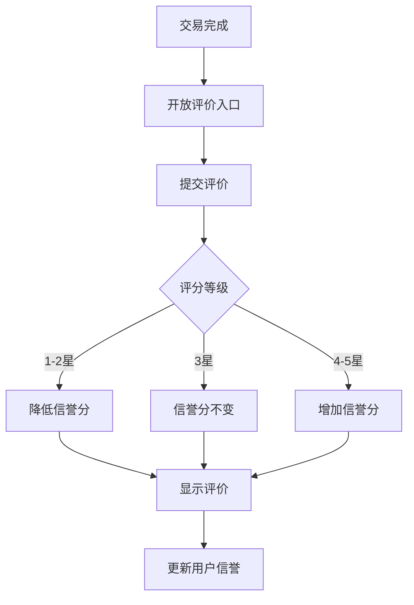
```mermaid
graph TD
    A[交易完成] --> B[开放评价入口]
    B --> C[提交评价]
    C --> D{评分等级}
    D -->|1-2星| E[降低信誉分]
    D -->|3星| F[信誉分不变]
    D -->|4-5星| G[增加信誉分]
    E --> H[显示评价]
    F --> H
    G --> H
    H --> I[更新用户信誉]
```

#### 需求 19：信誉积分系统
**用户故事：** 作为用户，我希望查看自己和他人的信誉积分，以便判断交易对象的可靠性。

##### 验收标准
1. 当用户完成一次成功交易时，系统应当增加10点信誉积分
2. 当用户获得差评时，系统应当扣除20点信誉积分
3. 当信誉积分低于60分时，系统应当显示"低信誉"警告标识

> ##### 类型：状态驱动
##### 处理逻辑：
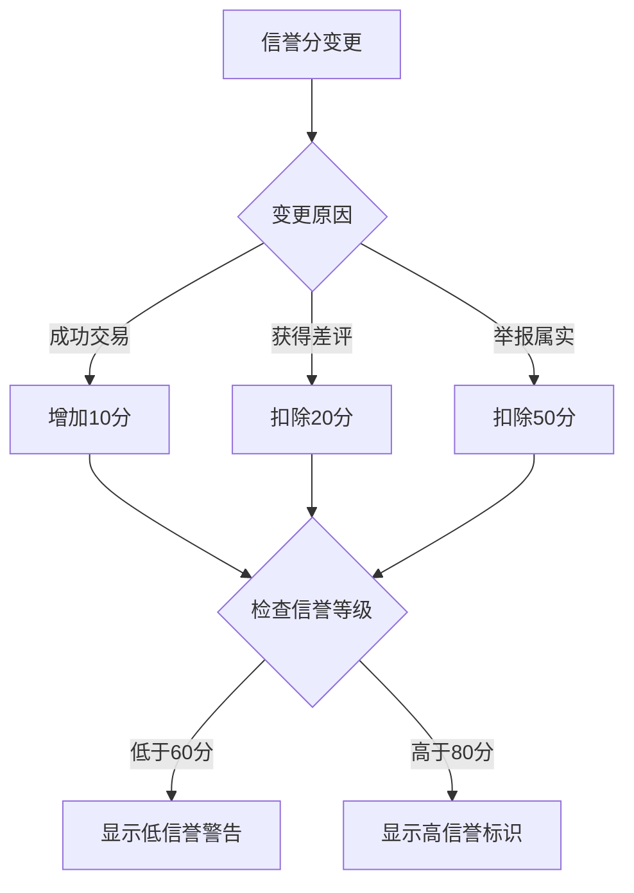
```mermaid
graph TD
    A[信誉分变更] --> B{变更原因}
    B -->|成功交易| C[增加10分]
    B -->|获得差评| D[扣除20分]
    B -->|举报属实| E[扣除50分]
    C --> F{检查信誉等级}
    D --> F
    E --> F
    F -->|低于60分| G[显示低信誉警告]
    F -->|高于80分| H[显示高信誉标识]
```

#### 需求 20：举报功能
**用户故事：** 作为用户，我希望举报虚假图书信息或不良行为，以便维护平台环境。

##### 验收标准
1. 当用户发现虚假图书时，系统应当提供举报入口
2. 当用户提交举报时，系统应当要求上传证据图片和描述
3. 当举报处理后，系统应当向举报人反馈处理结果

> ##### 类型：事件驱动
##### 处理逻辑：
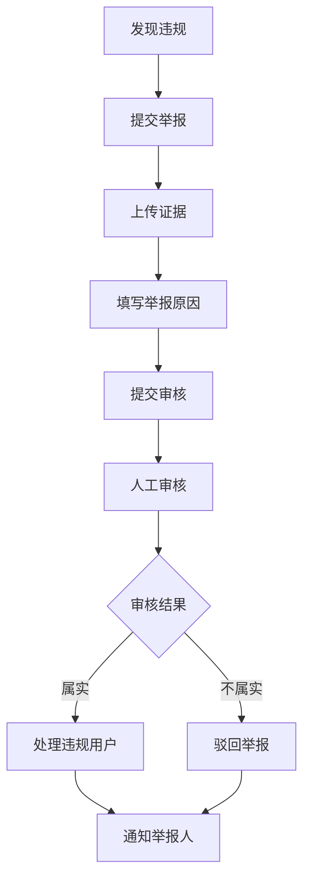
```mermaid
graph TD
    A[发现违规] --> B[提交举报]
    B --> C[上传证据]
    C --> D[填写举报原因]
    D --> E[提交审核]
    E --> F[人工审核]
    F --> G{审核结果}
    G -->|属实| H[处理违规用户]
    G -->|不属实| I[驳回举报]
    H --> J[通知举报人]
    I --> J
```

## 4. 非功能需求
### 4.1 性能指标
| 场景      | 要求         | 验证方式     |
| --------- | ------------ | ------------ |
| 图书搜索  | 响应时间<2秒 | 压力测试     |
| 图片上传  | 单张<5秒，支持9张批量 | 功能测试     |
| 并发用户  | 支持1000并发用户 | JMeter测试  |
| 数据库查询 | 查询响应<500ms | SQL优化测试 |
| 页面加载  | 首屏加载<3秒 | Lighthouse测试 |
| 图片压缩  | 自动压缩至<2MB | 文件大小测试 |

### 4.2 安全需求
- 🔒 用户密码强度策略：至少8位，包含大小写字母、数字、特殊字符
- 🔒 SQL注入防护：使用ORM框架，所有输入参数化查询
- 🔒 图片上传安全检查：检查文件头、文件类型白名单、文件大小限制
- 🔒 用户输入过滤：XSS防护，敏感字符转义
- 🔒 会话管理：JWT Token过期时间2小时，支持强制登出
- 🔒 数据加密：用户敏感信息AES加密存储
- 🔒 访问控制：基于角色的权限控制（RBAC）
- 🔒 审计日志：记录用户关键操作，保存6个月

### 4.3 兼容性
| 平台      | 支持版本     | 适配要求 |
| --------- | ------------ | -------- |
| 微信浏览器 | 最新2个版本  | 支持微信支付、微信登录 |
| 手机浏览器 | Chrome 80+   | 响应式布局，触摸操作优化 |
| 桌面浏览器 | Chrome 90+   | 支持拖拽上传、键盘快捷键 |
| iOS Safari | iOS 14+      | 适配iPhone、iPad屏幕尺寸 |
| Android WebView | Android 10+ | 适配主流安卓机型 |
| 微信小程序 | 基础库2.21+  | 支持小程序特有API |

## 5. 业务流程

### 5.1 图书发布流程
```mermaid
graph TD
    A[用户登录] --> B[点击发布图书]
    B --> C[填写图书信息]
    C --> D{输入ISBN}
    D -->|是| E[自动获取图书信息]
    D -->|否| F[手动填写完整信息]
    E --> G[上传实拍图片]
    F --> G
    G --> H[设置价格与成色]
    H --> I{价格合理性检查}
    I -->|价格>200| J[显示面交提示]
    I -->|价格正常| K[直接下一步]
    J --> L[用户确认]
    K --> L
    L --> M[选择交易地点]
    M --> N[确认发布]
    N --> O{信息完整性检查}
    O -->|完整| P[图书上架成功]
    O -->|不完整| Q[提示补充信息]
    Q --> C
    P --> R[生成图书详情页]
    R --> S[推送给可能感兴趣用户]
```

### 5.2 交易流程
```mermaid
graph TD
    A[买家浏览图书] --> B[找到心仪图书]
    B --> C[查看图书详情]
    C --> D{联系卖家沟通}
    D --> E[协商交易细节]
    E --> F[买家点击立即购买]
    F --> G{检查图书状态}
    G -->|在售| H[生成订单]
    G -->|已预订| I[提示图书已售出]
    H --> J[创建订单信息]
    J --> K[更新图书状态为已预订]
    K --> L[发送通知给双方]
    L --> M[订单状态：待自提]
    M --> N[约定面交时间地点]
    N --> O[面交验货]
    O --> P{买家确认图书无误}
    P -->|满意| Q[买家出示自提码]
    P -->|不满意| R[协商取消订单]
    Q --> S[卖家输入自提码]
    S --> T{验证自提码}
    T -->|正确| U[交易完成]
    T -->|错误| V[重新输入]
    U --> W[更新订单状态为已完成]
    W --> X[双方互评]
    R --> Y[取消订单]
    Y --> Z[图书重新上架]
```

### 5.3 自提确认流程
```mermaid
graph TD
    A[订单状态：待自提] --> B[系统生成买家自提码]
    B --> C[买家保存自提码]
    C --> D[约定面交时间]
    D --> E[见面验货]
    E --> F[买家打开自提码]
    F --> G[卖家扫码或输入自提码]
    G --> H{系统验证自提码}
    H -->|验证成功| I[显示交易确认]
    H -->|验证失败| J[提示错误重新输入]
    J --> G
    I --> K[双方确认交易完成]
    K --> L[系统自动标记订单完成]
    L --> M[更新图书状态为已售出]
    M --> N[发送交易完成通知]
    N --> O[开放评价入口]
    O --> P[双方互评]
    P --> Q[更新信誉积分]
```